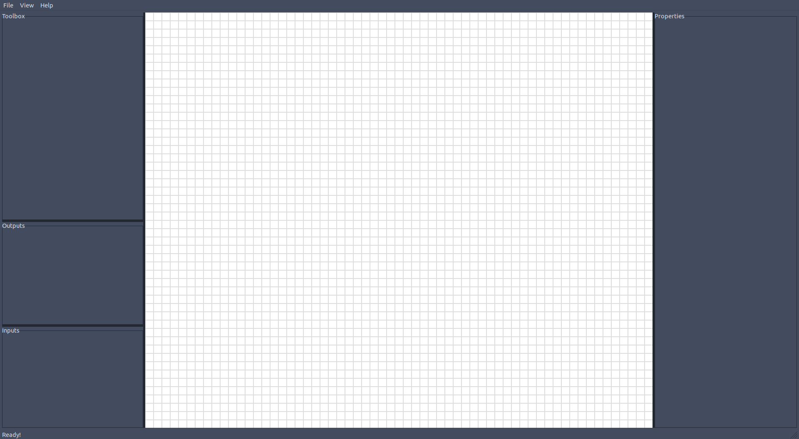

[docs/1-Description.md](docs/1-Description.md)
Description
===
This is a GUI application that allows for construction and simulation of
circuits using simple mouse and keyboard controls. The premise is that there is
a grid of points, where wires can connect. Upon each grid 'node', a gate
can be placed. Sub-Circuits will be supported eventually.

Wanted Features
---
- [X] Generate a grid where we can place nodes
- [X] GUI controls, as well as keyboard where it makes sense.
- [X] Panning and Zooming on 'board'
- [X] Toolbox for simple gates.
- [ ] Rotation of simple gates.
- [ ] Simulate electric charge going through the circuit
- [ ] Sub-circuits
- [X] Cross-Platform, including Web
- [ ] Export to picture, video, and code
- [ ] Wires that can go 'underneath' other wires

More wanted features are shown
[here](https://github.com/KaceCottam/WireStructure/projects/1?add_cards_query=is%3Aopen),
in the project tab of github.

[docs/2-Technologies.md](docs/2-Technologies.md)
Technologies
===
- C++
- C++ STL
- WxWidgets

I am using `C++` and `WxWidgets`.  WxWidgets for graphics is simple, and I am
tutoring in C++. Since this is a teaching tool, it makes sense that I am going
to show the code for making this to my tutees as well.

[docs/3-Roadmap.md](docs/3-Roadmap.md)
Roadmap
===

Using the [standard semantic versioning scheme](https://semver.org/),
V\<MAJOR\>.\<MINOR\>[.\<PATCH\>]  
- _italicized_ items are not prioritized-- they may happen and they may not.

V1.0 "DRAWABLE CIRCUITS"
---
Drawing of circuit diagrams, with some basic gates, multiplexers.
The goal at this point is to be able to draw a MIPS architecture diagram,
like as presented in the picture below.

_V1.1_
---
Variable-input gates for `AND`, `OR`, `NAND`, `XOR`, `XNOR`, `MULTIPLEXER`, etc.

V1.2 "LOGIC CIRCUITS"
---
Adding on to drawing: We can now simulate basic on and off functionality
through wires. We should be able to color wires based on their state (if wanted)
and we should be able to generate input sequences through manual activation.
The goal at this point is to simulate basic logic circuits that use single-bit
wires.

_V1.3_
---
Generate input sequences using function-based activation (such as a waveform).

_V1.4_
---
See resulting boolean algebra at the output. Insert a sequence of gates using
boolean algebra.

V1.5 "COMPUTER ARCHITECTURE"
---
We should be able to make wires with multiple bits, and split those wires.
The goal at this point is to fully simulate a MIPS architecture diagram.

V2.0 "MORE THAN LOGIC"
---
We should be able to add other circuit components based in physics, as well
as measure voltage, current, etc.

[docs/4-Interface.md](docs/4-Interface.md)
Interface
===

The interface is going to be very simplistic and understandable.
There is an emphasis on fluid interaction within the program.

[docs/UML-Canvas.md](docs/UML-Canvas.md)
[![](https://mermaid.ink/img/eyJjb2RlIjoiY2xhc3NEaWFncmFtXG5jbGFzcyBHYXRle1xuICA8PGFic3RyYWN0Pj5cbiAgR2F0ZSgpXG5cbiAgK0NyZWF0ZSgpIEdhdGUkXG5cbiAgI0xpc3R-R2F0ZX4gaW5wdXRzXG4gICNMaXN0fkdhdGV-IG91dHB1dHNcblxuICArQWRkSW5wdXQoR2F0ZSkgdm9pZFxuICArQWRkT3V0cHV0KEdhdGUpIHZvaWRcblxuICArQ29ubmVjdChHYXRlIHRvKSB2b2lkXG4gICtDb25uZWN0KEdhdGUgZnJvbSwgR2F0ZSB0bykgdm9pZCRcbiAgK0Nvbm5lY3QoTGlzdH5HYXRlfiBnYXRlcykgdm9pZCRcbiAgK0Rpc2Nvbm5lY3QoR2F0ZSB0bykgdm9pZFxuICArRGlzY29ubmVjdChHYXRlIGZyb20sIEdhdGUgdG8pIHZvaWQkXG4gICtEaXNjb25uZWN0KExpc3R-R2F0ZX4gZ2F0ZXMpIHZvaWQkXG5cbiAgK1JlbmRlcih3eERDKSB2b2lkKlxuICB-R2V0QW5jaG9yUG9pbnRzKCkgTGlzdH53eFBvaW50fipcbiAgI1JlbmRlckFuY2hvclBvaW50cygpIHZvaWRcblxuICAjT25Nb3VzZUVudGVyKHd4TW91c2VFdmVudCkgdm9pZFxuICAjT25Nb3VzZUxlYXZlKHd4TW91c2VFdmVudCkgdm9pZFxuICAjT25MZWZ0RG93bih3eE1vdXNlRXZlbnQpIHZvaWRcbiAgI09uTGVmdFVwKHd4TW91c2VFdmVudCkgdm9pZFxuICAjT25XaW5kb3dVcGRhdGUod3hJZGxlRXZlbnQpIHZvaWRcbn1cblxuR2F0ZSBcIjIuLjhcIiAuLnw-IFwiMVwiIE5vdEdhdGUgICAgIDogMSBpbnB1dCwgMSBvdXRwdXRcbkdhdGUgXCIzLi44XCIgLi58PiBcIjFcIiBBbmRHYXRlICAgICA6IDItNyBpbnB1dHMsIDEgb3V0cHV0XG5HYXRlIFwiMy4uOFwiIC4ufD4gXCIxXCIgT3JHYXRlICAgICAgOiAyLTcgaW5wdXRzLCAxIG91dHB1dFxuR2F0ZSBcIjMuLjhcIiAuLnw-IFwiMVwiIFhvckdhdGUgICAgIDogMi03IGlucHV0cywgMSBvdXRwdXRcbkdhdGUgXCIzLi44XCIgLi58PiBcIjFcIiBOb3JHYXRlICAgICA6IDItNyBpbnB1dHMsIDEgb3V0cHV0XG5HYXRlIFwiMy4uOFwiIC4ufD4gXCIxXCIgWG5vckdhdGUgICAgOiAyLTcgaW5wdXRzLCAxIG91dHB1dFxuR2F0ZSBcIjEuLjhcIiAuLnw-IFwiMVwiIElucHV0ICAgICAgIDogMCBpbnB1dHMsIDEtOCBvdXRwdXRzXG5HYXRlIFwiMVwiICAgIC4ufD4gXCIxXCIgT3V0cHV0ICAgICAgOiAxIGlucHV0LCAwIG91dHB1dHNcbkdhdGUgXCI0Li5uXCIgLi58PiBcIjFcIiBNdWx0aXBsZXhlciA6IDMtbiBpbnB1dHMsIDEgb3V0cHV0XG5cbmNsYXNzIEdhdGVMYWJlbHtcbiAgK1N0cmluZyB0ZXh0XG5cbiAgR2F0ZUxhYmVsKFN0cmluZyBkZWZhdWx0VGV4dClcblxuICArQ3JlYXRlKFN0cmluZyBkZWZhdWx0VGV4dCkkXG5cbiAgK09uQ2hhbmdlTGFiZWwoU3RyaW5nIHRleHQpIHZvaWRcbn1cblxuR2F0ZUhvbGRlciAqLS0gXCIxXCIgR2F0ZVxuR2F0ZUhvbGRlciAqLS0gXCIxXCIgR2F0ZUxhYmVsXG5cbmNsYXNzIENhbnZhc3tcbiAgK0xpc3R-R2F0ZX4gbV9jaGlsZHJlblxuXG4gICtNYWtlR2F0ZShHYXRlS2luZCkgfVxuXG5DYW52YXMgby0tIFwiblwiIEdhdGUiLCJtZXJtYWlkIjp7InRoZW1lIjoiZGVmYXVsdCJ9fQ)](https://mermaid-js.github.io/mermaid-live-editor/#/edit/eyJjb2RlIjoiY2xhc3NEaWFncmFtXG5jbGFzcyBHYXRle1xuICA8PGFic3RyYWN0Pj5cbiAgR2F0ZSgpXG5cbiAgK0NyZWF0ZSgpIEdhdGUkXG5cbiAgI0xpc3R-R2F0ZX4gaW5wdXRzXG4gICNMaXN0fkdhdGV-IG91dHB1dHNcblxuICArQWRkSW5wdXQoR2F0ZSkgdm9pZFxuICArQWRkT3V0cHV0KEdhdGUpIHZvaWRcblxuICArQ29ubmVjdChHYXRlIHRvKSB2b2lkXG4gICtDb25uZWN0KEdhdGUgZnJvbSwgR2F0ZSB0bykgdm9pZCRcbiAgK0Nvbm5lY3QoTGlzdH5HYXRlfiBnYXRlcykgdm9pZCRcbiAgK0Rpc2Nvbm5lY3QoR2F0ZSB0bykgdm9pZFxuICArRGlzY29ubmVjdChHYXRlIGZyb20sIEdhdGUgdG8pIHZvaWQkXG4gICtEaXNjb25uZWN0KExpc3R-R2F0ZX4gZ2F0ZXMpIHZvaWQkXG5cbiAgK1JlbmRlcih3eERDKSB2b2lkKlxuICB-R2V0QW5jaG9yUG9pbnRzKCkgTGlzdH53eFBvaW50fipcbiAgI1JlbmRlckFuY2hvclBvaW50cygpIHZvaWRcblxuICAjT25Nb3VzZUVudGVyKHd4TW91c2VFdmVudCkgdm9pZFxuICAjT25Nb3VzZUxlYXZlKHd4TW91c2VFdmVudCkgdm9pZFxuICAjT25MZWZ0RG93bih3eE1vdXNlRXZlbnQpIHZvaWRcbiAgI09uTGVmdFVwKHd4TW91c2VFdmVudCkgdm9pZFxuICAjT25XaW5kb3dVcGRhdGUod3hJZGxlRXZlbnQpIHZvaWRcbn1cblxuR2F0ZSBcIjIuLjhcIiAuLnw-IFwiMVwiIE5vdEdhdGUgICAgIDogMSBpbnB1dCwgMSBvdXRwdXRcbkdhdGUgXCIzLi44XCIgLi58PiBcIjFcIiBBbmRHYXRlICAgICA6IDItNyBpbnB1dHMsIDEgb3V0cHV0XG5HYXRlIFwiMy4uOFwiIC4ufD4gXCIxXCIgT3JHYXRlICAgICAgOiAyLTcgaW5wdXRzLCAxIG91dHB1dFxuR2F0ZSBcIjMuLjhcIiAuLnw-IFwiMVwiIFhvckdhdGUgICAgIDogMi03IGlucHV0cywgMSBvdXRwdXRcbkdhdGUgXCIzLi44XCIgLi58PiBcIjFcIiBOb3JHYXRlICAgICA6IDItNyBpbnB1dHMsIDEgb3V0cHV0XG5HYXRlIFwiMy4uOFwiIC4ufD4gXCIxXCIgWG5vckdhdGUgICAgOiAyLTcgaW5wdXRzLCAxIG91dHB1dFxuR2F0ZSBcIjEuLjhcIiAuLnw-IFwiMVwiIElucHV0ICAgICAgIDogMCBpbnB1dHMsIDEtOCBvdXRwdXRzXG5HYXRlIFwiMVwiICAgIC4ufD4gXCIxXCIgT3V0cHV0ICAgICAgOiAxIGlucHV0LCAwIG91dHB1dHNcbkdhdGUgXCI0Li5uXCIgLi58PiBcIjFcIiBNdWx0aXBsZXhlciA6IDMtbiBpbnB1dHMsIDEgb3V0cHV0XG5cbmNsYXNzIEdhdGVMYWJlbHtcbiAgK1N0cmluZyB0ZXh0XG5cbiAgR2F0ZUxhYmVsKFN0cmluZyBkZWZhdWx0VGV4dClcblxuICArQ3JlYXRlKFN0cmluZyBkZWZhdWx0VGV4dCkkXG5cbiAgK09uQ2hhbmdlTGFiZWwoU3RyaW5nIHRleHQpIHZvaWRcbn1cblxuR2F0ZUhvbGRlciAqLS0gXCIxXCIgR2F0ZVxuR2F0ZUhvbGRlciAqLS0gXCIxXCIgR2F0ZUxhYmVsXG5cbmNsYXNzIENhbnZhc3tcbiAgK0xpc3R-R2F0ZX4gbV9jaGlsZHJlblxuXG4gICtNYWtlR2F0ZShHYXRlS2luZCkgfVxuXG5DYW52YXMgby0tIFwiblwiIEdhdGUiLCJtZXJtYWlkIjp7InRoZW1lIjoiZGVmYXVsdCJ9fQ)

