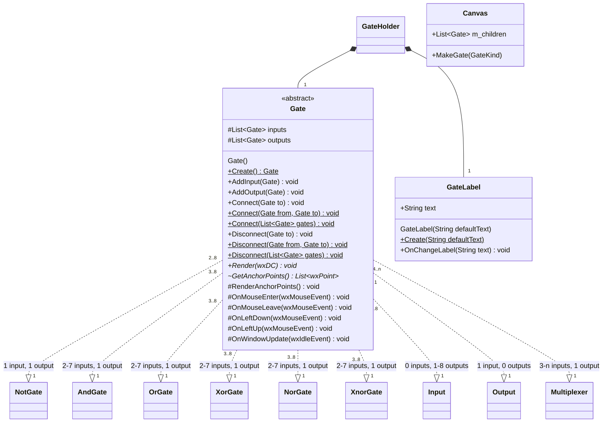

```mermaid
classDiagram
class Gate{
  <<abstract>>
  Gate()

  +Create() Gate$

  #List~Gate~ inputs
  #List~Gate~ outputs

  +AddInput(Gate) void
  +AddOutput(Gate) void

  +Connect(Gate to) void
  +Connect(Gate from, Gate to) void$
  +Connect(List~Gate~ gates) void$
  +Disconnect(Gate to) void
  +Disconnect(Gate from, Gate to) void$
  +Disconnect(List~Gate~ gates) void$

  +Render(wxDC) void*
  ~GetAnchorPoints() List~wxPoint~*
  #RenderAnchorPoints() void

  #OnMouseEnter(wxMouseEvent) void
  #OnMouseLeave(wxMouseEvent) void
  #OnLeftDown(wxMouseEvent) void
  #OnLeftUp(wxMouseEvent) void
  #OnWindowUpdate(wxIdleEvent) void
}

Gate "2..8" ..|> "1" NotGate     : 1 input, 1 output
Gate "3..8" ..|> "1" AndGate     : 2-7 inputs, 1 output
Gate "3..8" ..|> "1" OrGate      : 2-7 inputs, 1 output
Gate "3..8" ..|> "1" XorGate     : 2-7 inputs, 1 output
Gate "3..8" ..|> "1" NorGate     : 2-7 inputs, 1 output
Gate "3..8" ..|> "1" XnorGate    : 2-7 inputs, 1 output
Gate "1..8" ..|> "1" Input       : 0 inputs, 1-8 outputs
Gate "1"    ..|> "1" Output      : 1 input, 0 outputs
Gate "4..n" ..|> "1" Multiplexer : 3-n inputs, 1 output

class GateLabel{
  +String text

  GateLabel(String defaultText)

  +Create(String defaultText)$

  +OnChangeLabel(String text) void
}

GateHolder *-- "1" Gate
GateHolder *-- "1" GateLabel

class Canvas{
  +List~Gate~ m_children

  +MakeGate(GateKind)
}
```
